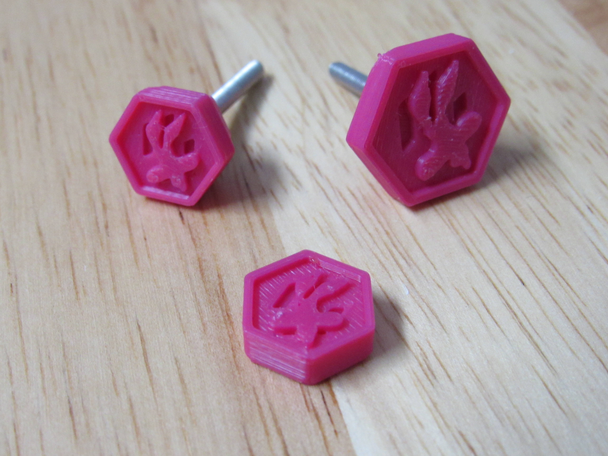

# WileE Tension Adjustment Knob
 

I created this awhile back sort of in tribute to the designer of StealthBurner. (Thanks wile.e!)

I haven't built stealthburner yet (and I probably won't build clockwork2 - I use LGX), so this remains untested.

The heatset M3 SHCS probably won't work (too weak), but epoxying the flat one to an existing thumbscrew might.

Anyway, I haven't worked on these since February, but I thought I'd leave all my files here in case anyone is interested.

Feel free to take it and run with it, I probably won't get back to it.

Cheers, Scotty